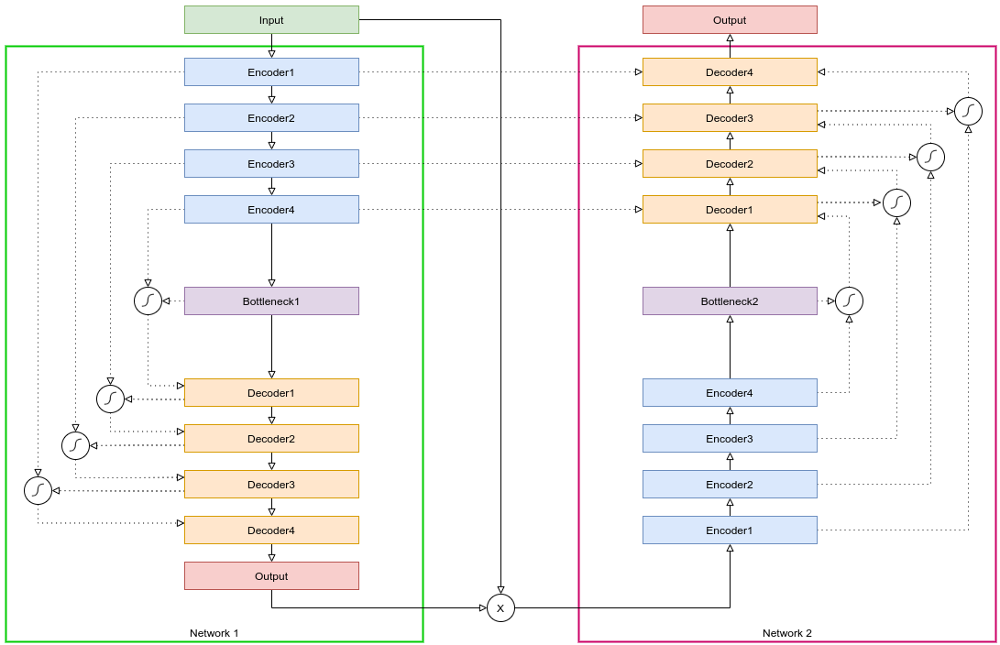
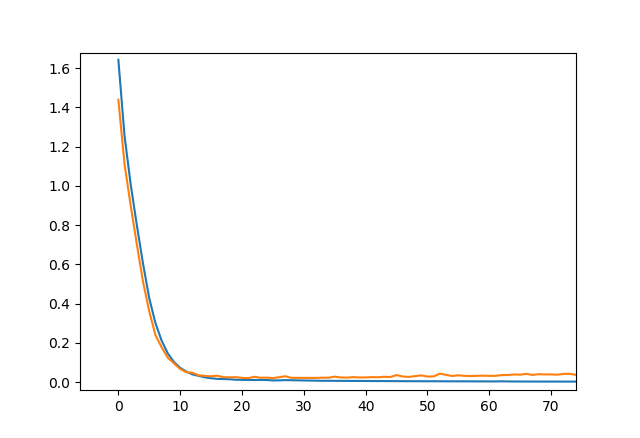
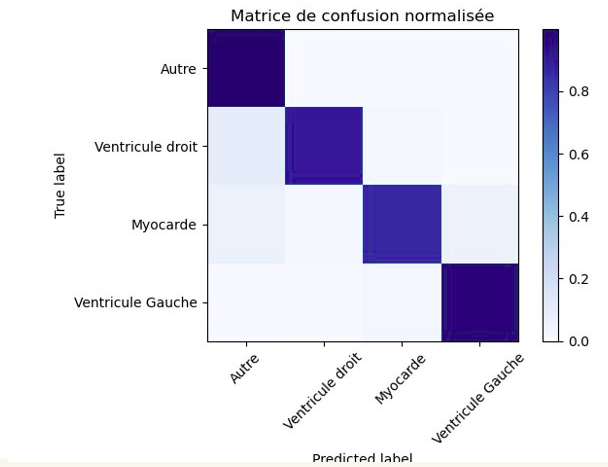
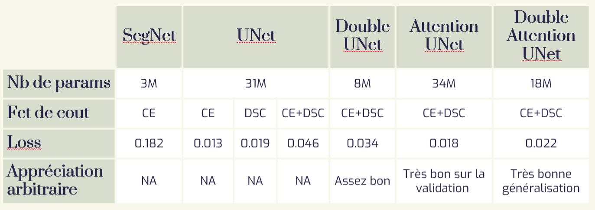
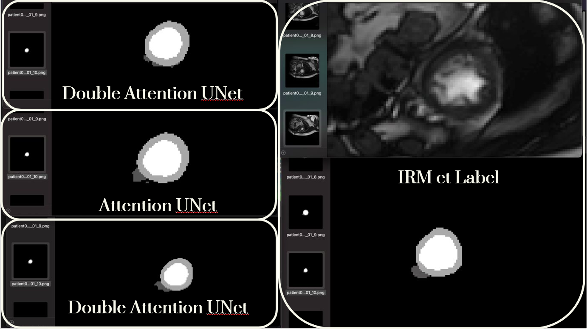

# HeartSegmentation
Testing of several known deep learning models for IRM heart segmentation and a novel model, Double attention Unet.

## Double Attention Unet architecture
 

Inspired by : 
- Oktay O, Schlemper J, Folgoc L L, et al. Attention u-net: Learning where to look for the pancreas[J]. arXiv preprint arXiv:1804.03999, 2018. 

- D. Jha, M. A. Riegler, D. Johansen, P. Halvorsen et H. D. Johansen, « DoubleU-Net: A Deep Convolutional Neural Network for Medical Image Segmentation », 2020 IEEE 33rd International Symposium on Computer-Based Medical Systems (CBMS),2020, pp. 558-564, doi: 10.1109/CBMS49503.2020.00111.

## Results

### Learning of Double Attention Unet
 

### Confusion matrix

### Tested model stats

### Visualisation
 

Sometimes better than the actual label
